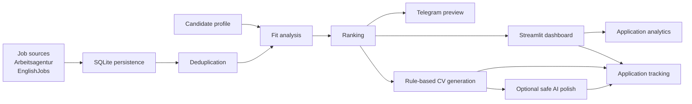
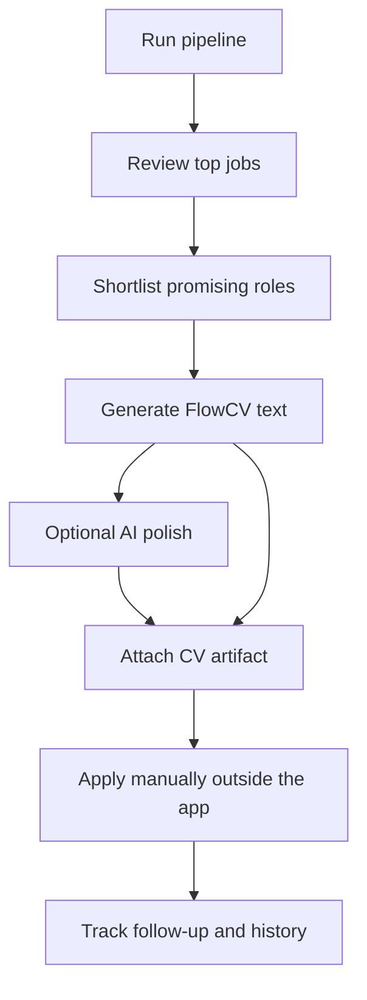

# AI Job Hunt Platform

A local-first job search automation platform that collects roles, deduplicates
vacancies, scores job fit, supports application tracking, and generates
truthful FlowCV-ready CV text without auto-applying or making hidden network
calls.

## Problem

Job hunting becomes messy quickly: listings are duplicated across sources, job
descriptions vary in quality, fit decisions are hard to compare, CV tailoring is
time-consuming, and application follow-up lives in scattered notes. This project
turns that workflow into a reproducible local system with auditable data and
explicit safety gates.

## What It Does

The platform ingests jobs from supported sources, stores them in SQLite,
normalizes and deduplicates listings, runs deterministic fit analysis against a
versioned candidate profile, ranks logical vacancies, previews notifications,
tracks application state, and creates FlowCV text artifacts. Optional AI polish
can improve wording, but only when explicitly enabled and only when protected
facts still validate.

## Why It Matters

The goal is not to automate away human judgment. The goal is to make the
judgment easier: show the best matches first, preserve evidence, avoid duplicate
work, keep application history clean, and produce CV drafts that remain truthful
to the candidate's verified profile.

## Core Workflow



## Daily Workflow



## Tech Stack

- Python 3.11+
- SQLite with ordered migrations, WAL mode, foreign keys, and repository layer
- Pydantic settings and typed domain models
- Requests-based source and AI provider integrations with injectable transports
- Streamlit dashboard as an optional local UI
- Pytest fixture-first test suite with opt-in live smoke tests only
- Mermaid diagrams in documentation

## Feature Overview

- One-command pipeline for collection, deduplication, analysis, ranking,
  notification preview, and JSON summaries.
- Local daily-run wrapper for command-line or Windows Task Scheduler execution.
- Arbeitsagentur and EnglishJobs collection behind source-neutral contracts.
- Description completeness tracking: `full`, `snippet`, and `missing`.
- SQLite persistence for jobs, descriptions, profiles, analyses, rankings,
  notifications, application events, CV artifacts, and legacy import metadata.
- Explainable deduplication with conservative gray-zone review.
- Deterministic fit analysis and logical-vacancy ranking.
- Offline Telegram preview and opt-in live delivery workflow.
- Local Streamlit dashboard for review, duplicate decisions, applications,
  application analytics, CV workflow, notifications, and run diagnostics.
- Application Tracking CRM with shortlist, status, priority, notes, follow-up
  dates, CV artifact links, and immutable history.
- Read-only application analytics for funnel progress, source quality,
  follow-ups, daily-run activity, and recent job-search movement.
- Rule-based FlowCV text generation with private evidence reports.
- Safe API-based AI CV polish using OpenAI-compatible or native Ollama Cloud
  providers.
- Protected-fact validation so AI output cannot silently change dates,
  employers, contact details, work authorization, education, languages, or
  other verified facts.
- Dry-run-first legacy import support for local CSV, JSON, TXT, and fixture
  MySQL reader workflows.

## Safety Principles

- Local-first by default: the app starts without credentials or API keys.
- No auto-apply: applications are always submitted manually outside the system.
- No live collection unless `--live-collect` or source-specific `--live` is used.
- No live Telegram send unless credentials are configured and `--live` is used.
- No AI call unless AI is configured and the user explicitly requests
  `--ai-polish` plus `--live-ai`.
- The rule-based CV remains the authoritative source of truth.
- AI artifacts are stored only as separate child artifacts after validation.
- `.env`, `data/`, runtime databases, and generated private artifacts are not
  committed.
- Tests use fixtures and temporary databases; ordinary automated tests do not
  call job sources, Telegram, Ollama, OpenAI-compatible providers, or MySQL.

See [docs/SAFETY.md](docs/SAFETY.md) for the full safety model.

## Screenshots

Screenshot placeholders are intentionally empty until anonymized images are
captured and reviewed for public sharing.

- Dashboard overview: `docs/images/dashboard-overview-placeholder.png`
- Jobs and ranking review: `docs/images/jobs-ranking-placeholder.png`
- CV workflow page: `docs/images/cv-workflow-placeholder.png`
- Application tracking page: `docs/images/application-tracking-placeholder.png`
- Application analytics page: `docs/images/application-analytics-placeholder.png`

## Setup

From the repository root in PowerShell:

```powershell
python -m venv .venv
.\.venv\Scripts\Activate.ps1
python -m pip install --upgrade pip
python -m pip install -e ".[dashboard,test]"
python -m app.db.migrations
```

The application can run without a `.env`. To customize local paths or opt into
integrations:

```powershell
Copy-Item .env.example .env
```

Do not commit real `.env` values or copy credentials from legacy projects.

## Daily Usage Commands

Run the safe local pipeline without live collection:

```powershell
python -m app.cli pipeline run `
  --profile-id <profile-id> `
  --query "Data Analyst" `
  --location Deutschland `
  --source arbeitsagentur `
  --top-n 10 `
  --preview-notification
```

Pipeline ranking is global by default, meaning `top_jobs` shows the best
overall stored jobs in the database. Use `--ranking-scope current-run` to review
only jobs collected or touched by that pipeline run.

Run a bounded live Arbeitsagentur collection:

```powershell
python -m app.cli collect arbeitsagentur --live `
  --query "Data Analyst" `
  --location Deutschland `
  --max-pages 1 `
  --page-size 10
```

Open the local dashboard:

```powershell
python -m app.dashboard
```

Review application analytics from the CLI:

```powershell
python -m app.cli analytics summary --profile-id <profile-id>
```

Run the local daily wrapper:

```powershell
python -m app.cli daily run-config --config config/daily_searches.local.json
```

Daily search configs default to current-run ranking so each morning digest shows
the jobs from that search first. Global ranking remains available with
`"ranking_scope": "global"`.

Shortlist a job:

```powershell
python -m app.cli applications shortlist `
  --profile-id <profile-id> `
  --job-id <job-id> `
  --priority high `
  --note "Strong fit"
```

Generate and inspect a FlowCV artifact:

```powershell
python -m app.cli cv generate --job-id <job-id> --profile-id <profile-id>
python -m app.cli cv show --artifact-id <artifact-id> --text
```

Optionally polish with a configured AI provider:

```powershell
python -m app.cli cv polish --artifact-id <rule-based-artifact-id> --live-ai
```

Attach a reviewed CV artifact:

```powershell
python -m app.cli applications cv-ready `
  --profile-id <profile-id> `
  --job-id <job-id> `
  --cv-artifact-id <artifact-id>
```

More demo commands are in [docs/DEMO.md](docs/DEMO.md).

## Test Results

Latest verified baseline:

- `python -m pytest` -> `272 passed, 2 skipped`
- `python -m compileall app tests` -> passed
- `git diff --check` -> passed
- `git diff -- existing_projects` -> unchanged

The skipped tests are optional live smoke tests for Arbeitsagentur and
EnglishJobs. They require explicit environment opt-in and are not part of the
ordinary offline verification path.

## Documentation

- [Demo guide](docs/DEMO.md)
- [Architecture](docs/ARCHITECTURE.md)
- [Safety model](docs/SAFETY.md)
- [Job sources](docs/SOURCES.md)
- [Roadmap](docs/ROADMAP.md)
- [Scheduler](docs/SCHEDULER.md)
- [Pipeline](docs/PIPELINE.md)
- [Dashboard](docs/DASHBOARD.md)
- [CV generation](docs/CV_GENERATION.md)
- [CV workflow](docs/CV_WORKFLOW.md)
- [Application tracking](docs/APPLICATION_TRACKING.md)
- [Legacy import](docs/LEGACY_IMPORT.md)

## Current Limitations

- No auto-apply or direct application submission.
- Scheduler support is local-only through CLI/PowerShell/Windows Task Scheduler.
- EnglishJobs full-description extraction remains conservative, so many records
  may stay snippet-only.
- FlowCV output is plain text; DOCX/PDF generation is outside the app.
- Telegram live sending is implemented but intentionally disabled by default.
- Real MySQL import is optional and not required for ordinary use or tests.
- Dashboard is local and single-user; it is not a hosted multi-user web app.
- Fit rules are deterministic and useful, but still benefit from calibration
  against reviewed outcomes.

## Future Roadmap

- Continue improving EnglishJobs full-description extraction where legally and
  technically safe.
- Improve scheduler observability and run-history review.
- Add stronger live Telegram safeguards and operator previews.
- Add more safe job sources behind the same adapter contract.
- Improve application analytics calibration with reviewed outcomes and longer
  trend windows.
- Package a final anonymized demo with screenshots and sample fixture data.

## Legacy References

The folders under `existing_projects/` are read-only reference implementations.
The unified application does not import or modify them.
