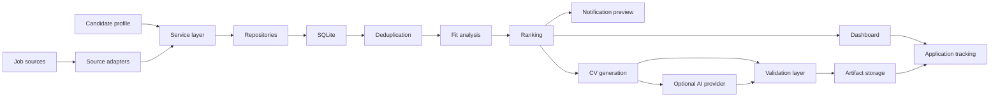

# Architecture

The AI Job Hunt Platform is organized as a local-first layered application.
Runtime behavior flows through CLI or dashboard entry points into typed services,
repositories, SQLite migrations, source adapters, and artifact storage.

## System Flow

## CLI Layer

`app.cli` is the main command surface. It exposes collection, deduplication,
profile import, fit analysis, ranking, notification preview/send, pipeline,
application tracking, legacy import, and CV workflows.

The CLI keeps orchestration explicit. Live operations require flags such as
`--live`, `--live-collect`, or `--live-ai`; ordinary commands remain local and
fixture/database-driven.

## Service Layer

Services contain business workflows and keep page/command code thin:

- Collection service persists source-independent jobs and descriptions.
- Deduplication service creates logical clusters and review candidates.
- Fit analysis service evaluates full descriptions against candidate evidence.
- Ranking service orders logical vacancies with deterministic components.
- Notification service builds previews and optional Telegram batches.
- Pipeline service composes collection, deduplication, analysis, ranking, and
  notification preview.
- Application service owns CRM transitions and immutable event history.
- CV generation service creates rule-based artifacts and optional validated AI
  derivatives.
- Legacy import service handles backup, dry-run, apply, verify, and reconcile.

## Repository And Database Layer

SQLite is the durable local store. Migrations are ordered and additive, with WAL
mode, foreign keys, busy timeout, and transaction-scoped repository operations.

Repositories isolate SQL from services and dashboard pages. They persist jobs,
description versions, profiles, duplicate clusters, analyses, rankings,
notifications, applications, CV artifacts, AI attempts, pipeline runs, and
legacy import audit records.

## Source Adapters

Source adapters implement a shared collection contract:

- Arbeitsagentur uses bounded search/detail requests with fixture-backed tests.
- EnglishJobs supports state and keyword/location flows with conservative
  description completeness handling.

Adapters normalize raw source payloads into typed summary/detail records. Tests
use fixtures and injected clients; live source requests require explicit opt-in.

## Dashboard

The Streamlit dashboard is optional and local. It uses thin query/action layers
instead of duplicating business rules in page files. Opening a page is passive:
it does not collect jobs, send messages, call AI, generate CVs, approve
duplicates, mutate application state, or open external vacancy links without
explicit action.

## AI Provider Abstraction

AI polish is behind provider interfaces. Supported provider styles are:

- OpenAI-compatible chat completions
- Native Ollama Cloud `/api/chat`

Providers receive prompts only after explicit live opt-in. They never log API
keys, prompts, CV text, job descriptions, or provider response bodies.

## Validation Layer

CV validation protects the truthful artifact contract:

- Rule-based CVs must contain required structure and protected facts.
- AI-polished CVs must preserve protected facts and avoid unsupported numbers,
  tools, named facts, stronger wording, sensitive claims, language claims, and
  broken/private-use characters.
- Safe polish mode restores locked sections from the rule-based artifact before
  validation.

## Artifact Storage

CV text, private evidence reports, AI attempt reports, and imported legacy
artifacts are stored as local files with database metadata and content hashes.
Generated artifacts live under ignored runtime paths and should not be committed.
