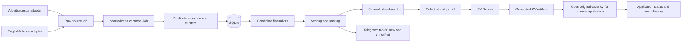

# Integration Architecture

## Architectural decision

Build one local, modular application around a shared domain and SQLite database. Legacy projects remain read-only references. Source adapters may understand source-specific JSON/HTML, but everything after collection operates on the same `Job` structure and identifiers.

The Streamlit dashboard is a delivery surface, not the application core. Collection, normalization, deduplication, scoring, notification, and CV generation must be callable from a CLI/scheduler and testable without Streamlit.

## End-to-end data flow



## Recommended folder structure

```text
AI_JOB_HUNT_PLATFORM/
├── app/
│   ├── config.py
│   ├── logging_config.py
│   ├── domain/
│   │   ├── enums.py
│   │   ├── job.py
│   │   ├── candidate.py
│   │   ├── analysis.py
│   │   └── application.py
│   ├── sources/
│   │   ├── base.py
│   │   ├── arbeitsagentur/
│   │   │   ├── adapter.py
│   │   │   ├── client.py
│   │   │   └── parser.py
│   │   └── englishjobs/
│   │       ├── adapter.py
│   │       ├── client.py
│   │       └── parser.py
│   ├── services/
│   │   ├── collection.py
│   │   ├── normalization.py
│   │   ├── deduplication.py
│   │   ├── language.py
│   │   ├── classification.py
│   │   ├── fit_analysis.py
│   │   ├── ranking.py
│   │   ├── notifications.py
│   │   ├── cv_generation.py
│   │   └── applications.py
│   ├── repositories/
│   │   ├── jobs.py
│   │   ├── runs.py
│   │   ├── profiles.py
│   │   ├── analyses.py
│   │   ├── notifications.py
│   │   ├── applications.py
│   │   └── artifacts.py
│   ├── integrations/
│   │   ├── telegram.py
│   │   └── ai/
│   │       ├── base.py
│   │       ├── ollama.py
│   │       └── openai.py
│   ├── cv/
│   │   ├── requirements.py
│   │   ├── evidence.py
│   │   ├── strategy.py
│   │   ├── builder.py
│   │   ├── validators.py
│   │   └── formatters/
│   │       ├── flowcv_text.py
│   │       ├── docx.py
│   │       └── pdf.py
│   ├── dashboard/
│   │   ├── Home.py
│   │   └── pages/
│   │       ├── Jobs.py
│   │       ├── Job_Detail.py
│   │       ├── CV_Builder.py
│   │       ├── Applications.py
│   │       └── Runs.py
│   └── cli.py
├── data/
│   ├── candidate/master_cv.json
│   ├── job_hunt.sqlite3
│   └── artifacts/
├── migrations/
├── tests/
│   ├── fixtures/arbeitsagentur/
│   ├── fixtures/englishjobs/
│   ├── unit/
│   ├── contract/
│   └── integration/
├── docs/
├── existing_projects/              # unchanged legacy reference
├── .env.example
├── pyproject.toml
└── README.md
```

`docx.py` and `pdf.py` are shown as the eventual location, not as milestone-1 work. FlowCV TXT is the only formatter already implemented.

## Source adapter contract

Each adapter implements the same interface:

```python
class JobSourceAdapter(Protocol):
    source: JobSource

    def collect(self, request: CollectionRequest) -> CollectionResult: ...
    def fetch_details(self, source_job_id: str, url: str | None) -> RawJobDetails: ...
    def to_job(self, raw: RawSourceJob, details: RawJobDetails | None) -> JobDraft: ...
```

`CollectionResult` carries jobs plus page/request/error metrics so a partial run is visible. Adapters never score, notify, write CSV, or update application status.

### Arbeitsagentur adapter

Reuse `search_jobs_for_role()`, `get_city()`, `get_job_link()`, `encode_ref_number()`, and the detail endpoint from `job_search_agent`. Improve it to:

- iterate API pages until exhausted or a configured safe limit;
- preserve raw JSON for diagnostics with retention limits;
- parse detail JSON into description, requirements, employer, locations, contract, and canonical source ID;
- return the original manual-application URL;
- use a shared `requests.Session` with timeouts, bounded retries, backoff, and 429/5xx handling;
- record each request/page error without aborting unrelated queries.

### EnglishJobs adapter

Use the intelligence state scraper/parser as the base and add the keyword/location URL mode from `englishjobs_scraper`. Improve it to:

- fixture-test the card selectors and total-count parser;
- enforce maximum pages and detect repeated page contents;
- preserve the listing/clickout identifiers separately;
- fetch the full detail page or safely resolve a canonical destination where permitted;
- store a complete description when available, otherwise explicitly mark `description_completeness='snippet'`;
- use the same shared HTTP resilience policy as Arbeitsagentur.

## Common `Job` model

The domain model should be a typed dataclass/Pydantic model; the database schema may split some fields into related tables.

```text
Job
  id: UUID                         internal stable ID
  source: enum                     arbeitsagentur | englishjobs
  source_job_id: str               source-native stable reference when available
  source_url: str                  URL collected from source
  canonical_url: str?              normalized final/original vacancy URL
  title_raw / title_normalized: str
  company_raw / company_normalized: str
  location_raw: str?
  city / region / country: str?
  remote_mode: enum?               onsite | hybrid | remote | unknown
  description_raw: str?
  description_normalized: str?
  description_completeness: enum   full | snippet | missing
  language_detected: str?
  language_confidence: float?
  published_at / expires_at: datetime?
  employment_type: str?
  source_payload_json: str?        bounded/debug retention
  first_seen_at / last_seen_at: datetime
  active: bool
  duplicate_cluster_id: UUID?
  created_at / updated_at: datetime
```

Uniqueness should first use `(source, source_job_id)` when a stable source ID exists, then canonical URL. It must not use a mutable title/company hash as the database primary key.

## Normalization service

Normalization produces searchable/comparable fields without destroying raw values:

- Unicode NFKC, whitespace, punctuation, casing, and legal-suffix normalization;
- title cleanup for gender suffixes and common formatting, while preserving seniority/role tokens;
- company aliases (`GmbH`, `AG`, group suffixes) using versioned alias rules;
- city/state/country normalization and a separate remote-mode field;
- HTML-to-text description normalization with safe tag handling;
- URL normalization that removes known tracking parameters but preserves a raw URL;
- language detection over the full description, with explicit German-requirement rules retained as separate signals.

Every normalization rule must be deterministic, versioned, and unit-tested.

## Duplicate-detection service

Use a layered, explainable matcher:

1. Exact source identity: same source and source job ID.
2. Canonical URL identity: same normalized original vacancy URL.
3. Strong fingerprint: normalized company + title + city plus publication-date proximity.
4. Cross-source similarity: token similarity for title/company/description, location compatibility, and date window.
5. Gray zone: store a candidate match with score/reasons for review; never silently merge uncertain pairs.

Keep each source row. A `duplicate_clusters`/`job_duplicate_links` layer designates the representative vacancy but preserves provenance and links. This is safer than deleting duplicates and allows a user to open the better URL.

## SQLite data model

Minimum tables:

| Table | Purpose / key constraints |
|---|---|
| `jobs` | One source vacancy row; unique `(source, source_job_id)` where present. |
| `job_descriptions` | Versioned raw/normalized detail text and completeness. |
| `duplicate_clusters` | Representative logical vacancy. |
| `job_duplicate_links` | Job-to-cluster match method, confidence, reasons, reviewed flag. |
| `candidate_profiles` | Versioned profile JSON and active flag. |
| `job_analyses` | Profile/job/analyzer-version unique result: requirements, evidence, missing skills, risks, fit score/reasons. |
| `collection_runs` | Source, status, start/end, totals, error summary, config snapshot. |
| `collection_run_items` | Page/query/state observations and errors. |
| `notifications` | Job/profile/channel unique delivery attempt, status, remote message ID, timestamp. |
| `applications` | One application state per logical vacancy/profile. |
| `application_events` | Append-only state history, notes, timestamp. |
| `cv_artifacts` | Job/profile/version/path/format/source (`rule_based`, `ai_polished`), validation status. |

Enable SQLite foreign keys, WAL mode, busy timeout, explicit migrations, and transaction-scoped repositories. Back up the DB before every schema migration.

## Shared fit analysis and ranking

Split two concerns:

- **Prefilter score:** cheap title/category/language/location/bank signals used to decide which descriptions need deeper analysis. Seed from the intelligence classifier/scorer and job-agent bank/location rules.
- **Fit score:** authoritative verified-evidence score from the CV tailor analysis stack. It consumes a stored full description and a versioned candidate profile, and persists structured matches, missing skills, risks, score, and reasons.

Ranking can combine explicit fields without hiding semantics, for example:

```text
rank_score = fit_score
           + freshness_bonus
           + preferred_location_bonus
           + optional_bank_preference_bonus
           - language_risk_penalty
```

Persist every component and `ranking_version`. Never overwrite an old analysis without preserving its version/timestamp.

## Telegram notification service

After a collection/analysis run commits:

1. Query representative logical vacancies that are new, active, sufficiently complete, above configured thresholds, and have no successful Telegram notification.
2. Order by rank and select at most `TELEGRAM_TOP_N` (default 20) across both sources.
3. Format concise messages containing title, company, location, source, score, short fit reason, and original URL.
4. Chunk messages under Telegram size limits.
5. Record each attempt transactionally; mark success only after the API confirms it.
6. A unique constraint prevents the same logical vacancy/profile/channel from being successfully sent twice. Failed attempts remain retryable.

Reuse the legacy sender’s successful-send semantics, not its source-coupled inline formatting or JSON history file.

## CV-generation service

Primary API:

```python
generate_for_job(job_id, profile_id, options) -> CVArtifact
```

The service loads the stored description, reuses or refreshes structured analysis, generates the rule-based CV, validates it, stores the artifact, and optionally requests AI polishing. The rule-based artifact is always retained. AI output is a derivative with provider/model/prompt/validation metadata.

Manual fallback API:

```python
generate_from_manual_description(text, profile_id, metadata=None) -> CVArtifact
```

Manual text may create an ephemeral/manual-source job row so analysis and artifacts still have stable IDs. It should not require clipboard copying when a stored job exists.

## Application lifecycle

Allowed states:

```text
new → shortlisted → cv_ready → applied → interview
  └──────────────→ skipped
shortlisted/cv_ready/applied/interview → rejected
skipped → shortlisted                  (explicit reopen)
```

Use enum values `new`, `shortlisted`, `cv_ready`, `applied`, `skipped`, `rejected`, and `interview`. Treat status changes as commands that validate transitions and append `application_events`. Generating a valid CV may suggest or optionally perform `shortlisted → cv_ready`; it must not mark `applied`. Application submission remains manual and outside scope.

## Dashboard

The Streamlit dashboard reads application services/repositories and provides:

- combined jobs table with source, freshness, language, fit, rank, status, and duplicate indicators;
- filters for source, location, role/category, language, score, date, and application status;
- job detail with stored full description, original-source links, match reasons, and duplicate provenance;
- explicit shortlist/skip/status actions;
- CV Builder launched with `job_id`, with manual JD fallback;
- generated-artifact history and manual-application link;
- collection run/error history and notification status.

The UI must not import legacy modules directly or contain SQL/HTTP calls.

## Configuration and logging

- One typed root settings loader reads `.env` once and supports temporary aliases described in `ENVIRONMENT_VARIABLES.md`.
- Use standard `logging` with timestamps, level, component, source, run ID, job ID, and error category. Redact secrets and avoid full CV/JD text in routine logs.
- Store run summaries/errors in SQLite; optionally rotate local JSON-line/text logs.
- Correlate collection → normalization → analysis → notification with `run_id`.

## Dependency direction

```text
dashboard / CLI / scheduler
        ↓
application services
        ↓
domain models and repository interfaces
        ↑
SQLite repositories, source adapters, Telegram, AI providers, formatters
```

Domain and service code must not import Streamlit, requests, SQLAlchemy, provider SDKs, or source parsers. This boundary is what makes source-independent behavior testable.

